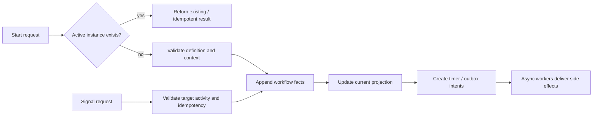

# hetuflow 工作流框架规格

> Status: 现行框架规格
> Scope: `hetuflow-core`、`hetuflow-runtime`、`hetuflow-sqlx`、`hetuflow-service`、`hetuflow`

`hetuflow` 是 Postgres-first durable workflow framework。它提供 workflow definition、event log、activity projection、timer、outbox、graph validation、advance decision 与 replay/rebuild 基础能力。

本规格是框架级 SSOT。消费方业务系统负责定义业务 flow、业务对象、权限、UI、callback handler、通知模板、scope 来源和 RPC 边界。

## 1. crate 边界

| Crate | 职责 |
|---|---|
| `hetuflow-core` | 领域类型、状态枚举、节点 / transition / event type、错误、纯 helper、adapter-facing trait |
| `hetuflow-runtime` | definition validation、graph lint、advance decision、CEL guard、replay reducer |
| `hetuflow-sqlx` | Postgres store trait 与默认实现、event-log / projection / outbox / timer 读写 |
| `hetuflow-service` | 事务内编排（start / signal / advance / join / fan-out / timer fire / resubmit / drift 核验）+ outbox dispatcher 与 timer poller 循环骨架 |
| `hetuflow` | 聚合 crate 与 feature 入口 |

feature 单调递增：`core` → `runtime` → `sqlx` → `service`。只做设计态校验的消费者（IR 编译器等）用 `runtime`，其依赖闭包内 MUST NOT 出现 store 与编排 crate。

`hetuflow-service` 不并入 `hetuflow-sqlx` 的理由：store crate 的契约是「在 caller 的事务上跑 SQL」（§16.1 A1 invariant），编排是组合决策与存储的另一层职责；合并会让只需要 store 的消费者被迫编译 runtime，并模糊 A1 边界。

框架 crate MUST NOT 依赖消费方业务 crate、业务 proto、业务权限模型、业务通知系统或业务 UI。

## 2. 目标

- Workflow MUST 以 append-only event-log 作为历史事实源；当前状态只表达事实源的最新 projection。
- Workflow MUST 支持 caller idempotency，重复 start、signal、timer fire、outbox delivery 不得制造重复业务结果。
- Workflow definition MUST 可版本化、可校验、可 replay。
- Timer MUST 可恢复、可重试、可取消；业务 SLA MUST NOT 依赖进程内 sleep。
- Side effect MUST 先记录为 outbox intent，再异步投递。
- Framework MUST expose generic hooks; application adapters decide auth, scope, callback routing, notification delivery and audit policy.

## 3. 非目标

- MUST NOT 内置任何业务域语义、业务权限码、业务角色、业务状态机或 UI 流程。
- MUST NOT 替代消费方业务系统自己的状态机。
- MUST NOT 为第三方 provider、通知 channel 或业务 callback 制定消费方特定路由规则。
- MUST NOT 允许 application 绕过自身授权、审计和隔离策略；框架只提供承载点。

## 4. 核心概念

| 概念 | 规范 |
|---|---|
| Definition | 工作流定义，描述节点、边、guard、timer、callback、notification、assignment 与终态结果。 |
| Instance | 某个业务对象上的 workflow 实例。active instance SHOULD 按业务 key 去重。 |
| Activity | 节点运行实例。Activity MUST 有明确状态、输入、输出和幂等边界。 |
| Signal | 外部输入事件，用于推进等待中的 workflow。Signal caller MUST 提供幂等键。 |
| Timer | 持久化时间触发点，用于提醒、升级、超时和计划触发。 |
| Outbox | 副作用投递意图。框架保证投递状态可追踪，不承诺业务侧 exactly-once。 |
| Event log | append-only 历史事实源，projection 与 drift report MUST 可由其重建。 |

## 5. 执行语义

- Start MUST validate definition before writing instance state.
- Signal MUST target a valid active activity or a valid business correlation chosen by the adapter.
- Timer fired MUST follow definition timeout behavior and remain idempotent.
- Outbox delivery success MAY complete side-effect activity only after the adapter confirms delivery success.
- Rejected / Returned / Completed / EventReceived semantics are determined by `hetuflow-runtime` and the node transition graph.

## 6. 节点模型

| 节点 | 规范 |
|---|---|
| Start | Definition entry. |
| Approval | Human or external approval gate. Framework stores role code as opaque string. |
| Condition | CEL-based routing node. MUST have default branch or provable full coverage. |
| Timer | Durable wait / timeout node. |
| Notification | Notification intent. Provider and template are adapter-owned. |
| BusinessCallback | Business side-effect intent. Handler routing is adapter-owned. |
| Assignment | Work item intent. Queue / role semantics are adapter-owned. |
| EventWait | Waits for external event correlation. Buffering/replay policy is adapter-owned. |
| ParallelSplit / ParallelJoin | Static branch fan-out and join with explicit strategy. |
| Merge | Serial no-op routing node; does not create activity row. |
| ForEach | Dynamic fan-out over CEL-evaluated array; joins through ParallelJoin. |
| SubWorkflow | Starts and waits for a child workflow instance. |
| End | Terminal workflow result. |

## 7. validation

- Definition MUST declare stable node ids and transitions.
- Definition MUST have valid Start / End topology.
- Definition MUST NOT contain dangling edges, unreachable nodes, deadlock nodes or unsupported nested structures.
- Expressions MUST be deterministic; parse or evaluation failure MUST be validation / runtime error, not silent branch selection.
- Running instance MUST use its bound definition snapshot; later definition changes MUST NOT rewrite in-flight semantics.

## 8. event-log 与 projection

- event type MUST use `namespace.snake_case.v1`.
- event payload MUST be self-describing enough for replay: include relevant node id, round, result, item index / payload and correlation facts where applicable.
- Projection rows are query optimization, not the source of truth.
- Drift report compares replayed canonical projection with live projection.
- Rebuild apply MUST restore projection to event-log-consistent state and MUST be auditable.

Detailed reducer / rebuild design: [hetuflow-projection-traceability.md](./hetuflow-projection-traceability.md).

## 9. 编排扩展契约

### 9.1 ReworkLoop

- Node declaring `RETURNED` transition enters precise rework: runtime resolves target, creates a new active activity at `round + 1`, and sets instance to `returned_waiting`.
- Node without `RETURNED` transition keeps whole-workflow resubmit semantics: completed with returned result, then adapter may reactivate from start.
- Effective round limit = `min(definition.max_round, framework global max)`.
- Rework target MUST be a valid upstream target declared by definition.

### 9.2 Merge

- Merge MUST have exactly one approved outgoing transition.
- Merge MUST NOT create activity rows, timers or outbox entries.
- Passing through Merge MUST append `workflow.merge_passed.v1`.
- Parallel branches MUST join with ParallelJoin, not Merge.

### 9.3 Topology lint

- `lint_definition` SHOULD expose dangling edge, unreachable node, deadlock node and unclosed parallel findings.
- Lint is read-only unless the consuming adapter explicitly promotes it to publish gate.

### 9.4 ForEach

- ForEach MUST declare `items_path`, `branch_template`, `join_target` and optional `max_fanout`.
- Runtime fan-out count MUST be recorded in `workflow.for_each_fanned_out.v1`.
- Join expectation for ForEach MUST be dynamic and round-scoped.
- Empty array is valid and SHOULD immediately satisfy the join path.

### 9.5 Runtime context write-back

- Runtime context defaults to Start-provided immutable input.
- Write-back is allowed only for fields explicitly listed in node `contextWrites`.
- Adapter MUST validate payload shape and value domain before write-back.
- Write-back MUST happen in the same transaction as activity completion and subsequent advance.

### 9.6 Mixed Parallel

- ParallelSplit branch target kind MAY be Approval, Assignment, EventWait or Notification.
- Branch activity type MUST be derived from branch node kind.
- Join incoming signals are `{APPROVED, COMPLETED, EVENT_RECEIVED}`.

### 9.7 SubWorkflow

- SubWorkflow starts child instance and keeps parent activity active until child terminal result is observed.
- Parent resume MUST re-enter normal signal path, not a simplified worker-only advance path.
- Definition validation MUST reject SubWorkflow nodes without a resumable EVENT_RECEIVED transition.

### 9.8 Compensation

Compensation / saga remains deferred. It MUST NOT be enabled until a consuming application defines idempotent reverse handlers and validates registration at definition publish time.

Detailed design record: [hetuflow-orchestration-gaps.md](./hetuflow-orchestration-gaps.md).

## 10. 编排与 worker（`hetuflow-service`）

### 10.1 事务纪律

- 请求驱动的编排方法（`start` / `signal` / `resubmit` / `fire_timer` / `on_*_delivered` / `verify_projection`）MUST 接 caller 已在事务内的 `&DbxPostgres`；框架 MUST NOT 自开事务、MUST NOT 设置会话变量（A1 invariant 上提到编排层）。
- worker 需要跨事务时经 `TxnRunner` 端口取得事务：`system_write`（跨租户轮询）与 `tenant_write`（按行所属租户结算）。实现 MUST 原样传播闭包的 `FlowError`——把它压成自有错误类型会毁掉 not-found / conflict / validation 的区分。
- 「append 事实 → 改投影 → 建 timer / outbox intent」MUST 在同一事务内，顺序 MUST 是事实先于投影。

### 10.2 幂等与去重

- `start` 按 `(business_type, business_key)` 幂等：命中未终态实例即原样返回，MUST NOT 报错、MUST NOT 建第二条。
- `signal` / `resubmit` 的 `idempotency_key` 必填，落 event-log 的 `idempotency_key` 列；重复投递返回首次结果且不推进。
- `fire_timer` 以 `status='pending'` CAS 去重（poller 允许把同一 timer 交给两趟，输者得 `false`）。
- outbox 是**至少一次**：投递成功后到结算前崩溃 → 租约到期重投。业务 handler MUST 幂等（§4）。

### 10.3 副作用

- 通知与业务回调一律先入 outbox 再异步投递；投递路由（provider / 模板 / 渠道）经 `NotificationDispatcher` 与 `CallbackRegistry` 端口，框架只转发不发明。
- 框架自产的两条通知（SLA 提醒、审批升级）的 `template_code` / 渠道策略取自 adapter 提供的 `WorkflowConfig`。
- 终态业务副作用是**实例级**意图（`NodeKind` 无 BusinessCallback 变体，而 `BusinessCallbackPayload` 携带 `business_type` / `business_key`）：随 `StartCommand.terminal_callback` 传入、记在 `workflow.started.v1` payload，实例以 `approved` 完成时入 outbox，handler 确认成功后才翻 `side_effects_executed`。
- 启动期即校验 terminal callback 的 handler 已注册（fail-closed）；到终态才发现无 handler 会让业务对象静默半成品。

### 10.4 timer kind

`reminder`（SLA 提醒）/ `escalation`（审批升级换 owner）/ `timeout`（EventWait 超时推进）。列在 store 侧是不透明串，语义由本层定义。

### 10.5 本期未接线（fail-closed，非静默降级）

- `SubWorkflow` 节点：需要「按 `flow_type` 解析 definition」的端口，store 契约未提供；调度到该 kind 显式报错，MUST NOT 把父实例挂死。
- Compensation / saga：§9.8 显式 deferred。

## 11. application adapter 责任

Application adapter owns:

- proto / HTTP / CLI surface;
- caller auth, permission and scope decisions;
- mapping trusted context into store filters;
- business callback handler registry;
- notification delivery integration;
- admin mutation authorization and audit sink;
- UI, reporting, and product-specific workflow semantics.

Framework crates only expose deterministic decisions and storage primitives.
